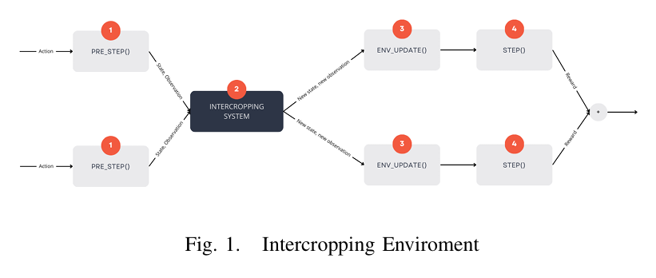
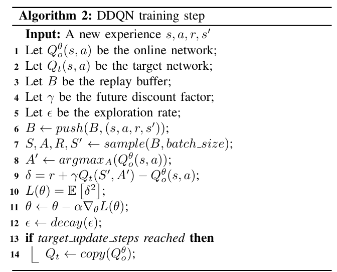
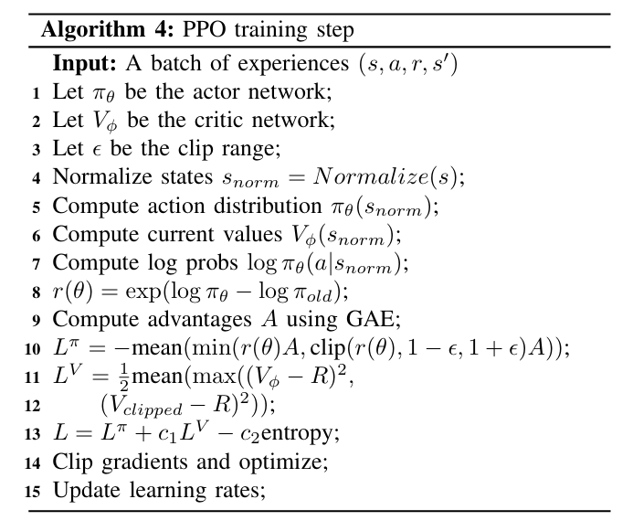
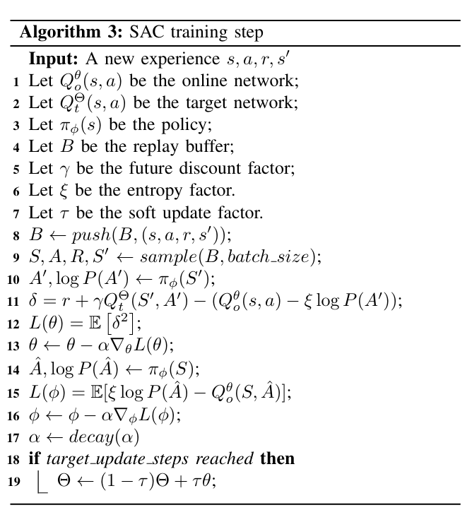

# InterCropGym 🇮🇹/🇬🇧 

## 🇮🇹 Italiano

**Disclaimer**: applicazione fatta per l'esame di _Reinforcement Learning_, nel secondo anno della facoltà magistrale di _AI & Robotics_ di _Sapienza Università di Roma_.

## Prerequisiti

Per comprendere appieno questo progetto, è utile avere familiarità con i seguenti concetti:

- **Agricoltura Rigenerativa**: È un approccio agricolo che mira a ripristinare e migliorare la salute del suolo, la biodiversità e i cicli idrologici, aumentando al contempo la produttività agricola. Si concentra sulla sostenibilità a lungo termine dell'ecosistema agricolo.
- **Intercropping (Consociazione)**: È una pratica agricola che consiste nel coltivare più colture contemporaneamente nello stesso campo. Questo può offrire benefici significativi per l'agricoltura sostenibile, come la riduzione della necessità di fertilizzanti chimici e una migliore gestione delle risorse.
- **CropGym**: È un ambiente di Reinforcement Learning basato sul modello di simulazione della crescita delle colture LINTUL-3 ( un simulatore di crescita raccolti ). È stato progettato per l'ottimizzazione della fertilizzazione in agricoltura, consentendo agli agenti di apprendere strategie per massimizzare la resa minimizzando l'impatto ambientale dell'eccesso di fertilizzazione. 

## Contributi

_InterCropGym_ è un progetto che punta nello sviluppo di una serie di modelli di Reinforcement Learning per l'ottimizzazione d'uso di fertilizzante nei raccolti in raccolti in consociazione. In particolare, i contributi principali sono stati:
- La creazione di un ambiente di Reinforcement Learning basato su _CropGym_ ma che funzionasse con la tecnica proposta di agricoltura rigenerativa: _InterCropGym_.
- L'utilizzo dell'ambiente creato su modelli di Reinforcement Learning per l'ottimizzazione del fertilizzante utilizzato.

## Come funziona InterCropGym?

Per creare l'ambiente di RL _InterCropGym_, una versione "aperta" di _CropGym_ è stata utilizzata. In particolare:
- Due istanze indipendenti di _CropGym_ sono create. Queste due istanze rappresentano i due raccolti piantati nello stesso campo.
- __PreStep__: un primo "step" è svolto nell'environment; in questo, dei valori preliminari delle variabili di stato sono calcolati coniderando ir accolti indiendenti.
- __InterCroppingSystem__: i valori pre-calcolati sono combinati attraverso un IntercroppingSystem per tenere conto della consociazione dei raccolti.
  <u>Nota</u> le formule e valori utilizzate non sono realmente rappresentative di reali calcoli agronomi, sono stati approssimati.
- __EnvUpdate__ e __Step__: le variabili di ambiente sono aggiornate con i nuovi valori calcolati.

  

## Modelli utilizzati:
I modelli di RL utilizzati sono stati:
- **DDQN**: una variante del DQN che usa due reti per ridurre la sovrastima dei valori Q, migliorando stabilità e prestazioni nell’apprendimento.
  

  
   

- **PPO**: un algoritmo di policy gradient che bilancia esplorazione e aggiornamenti stabili tramite clipping, garantendo un apprendimento affidabile.
  

  
   

- **SAC**: un algoritmo off-policy che massimizza il ritorno atteso e l’entropia della policy, ottenendo politiche esplorative ed efficienti.
  

  
   

**Consigliato**: per maggiori informazioni, leggere il report.

---

## 🇬🇧 English

**Disclaimer**: this application was developed for the _Reinforcement Learning_ exam in the second year of the master's program in _AI & Robotics_ at _Sapienza University of Rome_.

## Prerequisites

To fully understand this project, it is helpful to be familiar with the following concepts:

- **Regenerative Agriculture**: An agricultural approach aimed at restoring and improving soil health, biodiversity, and water cycles, while increasing crop productivity. It focuses on the long-term sustainability of the agricultural ecosystem.
- **Intercropping**: A farming practice that involves growing multiple crops simultaneously in the same field. This can offer significant benefits for sustainable agriculture, such as reduced need for chemical fertilizers and better resource management.
- **CropGym**: A Reinforcement Learning environment based on the LINTUL-3 crop growth simulation model. It was designed for optimizing fertilization in agriculture, allowing agents to learn strategies to maximize yield while minimizing the environmental impact of over-fertilization.

## Contributions

_InterCropGym_ is a project aimed at developing a series of Reinforcement Learning models for optimizing fertilizer use in intercropped fields. The main contributions include:
- The creation of a Reinforcement Learning environment based on _CropGym_ that supports the proposed regenerative agriculture approach: _InterCropGym_.
- The application of the custom environment to RL models for fertilizer optimization.

## How does InterCropGym work?

To create the _InterCropGym_ RL environment, an "open" version of _CropGym_ was used. Specifically:
- Two independent instances of _CropGym_ are created. These represent the two crops planted in the same field.
- __PreStep__: a preliminary step is executed in the environment, where initial state variable values are computed by treating the crops as independent.
- __InterCroppingSystem__: the pre-computed values are then combined through an InterCroppingSystem to account for crop interactions.
  <u>Note</u>: the formulas and values used are not intended to represent real agronomic calculations and are approximated.
- __EnvUpdate__ and __Step__: the environment variables are updated with the new computed values.

  

## RL Models Used

The following RL models were used:
- **DDQN**: a DQN variant that uses two networks to reduce Q-value overestimation, improving stability and learning performance.
  

    
  

- **PPO**: a policy gradient algorithm that balances exploration and stable updates using clipping, enabling reliable learning.
  

    
  

- **SAC**: an off-policy algorithm that maximizes expected return and policy entropy, leading to efficient and exploratory behavior.
  

    
  

**Recommended**: for more details, please read the full report.

---

# Installation
### Prerequisites
#### Ensure you have the following installed:
1. Python (>= 3.x)
2. pip
### Setup
#### Clone the repository:
`git clone https://github.com/federicomatarante/RegenerativeAgricoltureRL.git`

`cd yourproject`
#### Create a virtual environment (optional but recommended):
`python -m venv venv`

source `venv/bin/activate`  # On Windows use `venv\Scripts\activate`
### Install dependencies:
`pip install -r requirements.txt`
## Testing agents
### Test the DQN agent:
`python ./src/scripts/train_dqn_agent.py`
### Test the SAC agent:
`python ./src/scripts/train_sac_agent.py`
### Test the PPO agent:
`python ./src/scripts/train_ppo_agent.py`

## License

This research is licensed under CC BY-NC 4.0. For commercial applications, please contact us for licensing terms.
[leonardosandri99@gmail.com] [federico.matarante@gmail.com]

When citing this work:
[Research Title] by [Authors] - [Link to repository]

## How to cite me
`@software{InterCropGym,
   author = {Sandri Leonardo and Matarante Federico},
   title = {RegenerativeAgricoltureRL: Intercropping expansion of CropGym environment for simulation with Reinforcement Learning techniques},
   year = {2024},
   url = {https://github.com/federicomatarante/InterCropGym},
   version = {1.0.0}
}`
